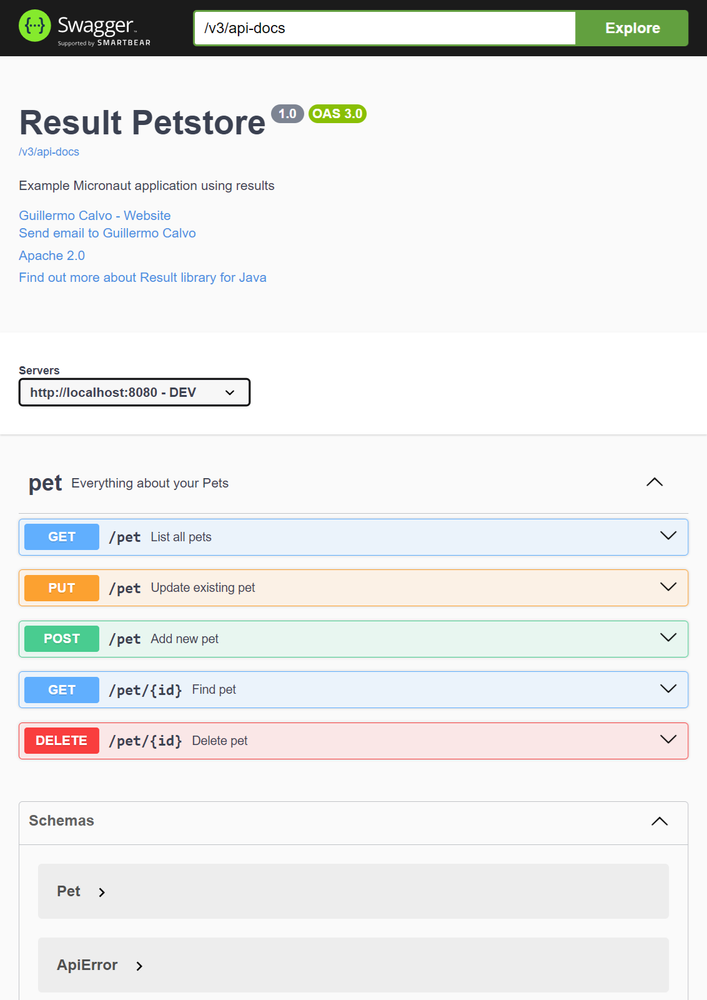

[![Build Status][BADGE_BUILD_STATUS]][BUILD_STATUS]
[![Gradle][BADGE_GRADLE]][GRADLE]
[![Spring Boot][BADGE_SPRING_BOOT]][SPRING_BOOT]
[![Maven Central][BADGE_RESULT_ARTIFACTS]][RESULT_ARTIFACTS]
[![Benchmark Report][BADGE_BENCHMARK]][BENCHMARK]


# Example Spring Boot Application Using Results

This is a simple implementation of a [Petstore][PET_STORE] server powered by [Spring Boot][SPRING_BOOT].

The purpose of this example application is to demonstrate how to make use of [Result][RESULT_LIBRARY] libraries in
projects based on Spring Boot 3. For the sake of brevity, the Petstore spec is implemented partially.


## Getting Started

Build and run the application.

```shell
./gradlew bootRun
```

This will start a stand-alone server on port 8080.


## Testing the Server

Once started, you can interact with the API.

```shell
curl -s -H 'x-type: local' http://localhost:8080/pet/0
```

You should see a JSON response like this:

```json
{"version":"1.0","result":{"success":{"id":0,"name":"Rocky","status":"AVAILABLE"}}}
```


## Using Swagger-UI

You can navigate to <http://localhost:8080/> to inspect the API using an interactive UI.




## Looking for Support?

We'd love to help. Check out the [support guidelines][SUPPORT].


## Contributions Welcome

If you'd like to contribute to this project, please [start here][CONTRIBUTING].


## Code of Conduct

This project is governed by the [Contributor Covenant Code of Conduct][CODE_OF_CONDUCT].
By participating, you are expected to uphold this code.


## Author

Copyright 2025 [Guillermo Calvo][AUTHOR].

[![][GUILLERMO_IMAGE]][GUILLERMO]


## License

This library is licensed under the *Apache License, Version 2.0* (the "License");
you may not use it except in compliance with the License.

You may obtain a copy of the License at <http://www.apache.org/licenses/LICENSE-2.0>

Unless required by applicable law or agreed to in writing, software distributed under the License
is distributed on an "AS IS" BASIS, **WITHOUT WARRANTIES OR CONDITIONS OF ANY KIND**, either express or implied.

See the License for the specific language governing permissions and limitations under the License.


**Permitted:**

- **Commercial Use**: You may use this library and derivatives for commercial purposes.
- **Modification**: You may modify this library.
- **Distribution**: You may distribute this library.
- **Patent Use**: This license provides an express grant of patent rights from contributors.
- **Private Use**: You may use and modify this library without distributing it.

**Required:**

- **License and Copyright Notice**: If you distribute this library you must include a copy of the license and copyright
  notice.
- **State Changes**: If you modify and distribute this library you must document changes made to this library.

**Forbidden:**

- **Trademark use**: This license does not grant any trademark rights.
- **Liability**: The library author cannot be held liable for damages.
- **Warranty**: This library is provided without any warranty.


[AUTHOR]:                       https://github.com/guillermocalvo/
[BADGE_BENCHMARK]:              https://img.shields.io/endpoint?url=https://dev.leakyabstractions.com/result-benchmark/badge.json&style=flat
[BADGE_BUILD_STATUS]:           https://github.com/leakyabstractions/result-example-spring-boot/workflows/Build/badge.svg
[BADGE_GRADLE]:                 https://img.shields.io/badge/Gradle-1FAEC9?logo=Gradle&logoColor=white
[BADGE_RESULT_ARTIFACTS]:       https://img.shields.io/endpoint?url=https://dev.leakyabstractions.com/result/badge.json
[BADGE_SPRING_BOOT]:            https://img.shields.io/badge/Spring%20Boot-3-black?logo=Spring&logoColor=white&labelColor=6DB33F
[BENCHMARK]:                    https://dev.leakyabstractions.com/result-benchmark/
[BUILD_STATUS]:                 https://github.com/LeakyAbstractions/result-example-spring-boot/actions?query=workflow%3ABuild
[CODE_OF_CONDUCT]:              https://dev.leakyabstractions.com/result/CODE_OF_CONDUCT.html
[CONTRIBUTING]:                 https://dev.leakyabstractions.com/result/CONTRIBUTING.html
[GRADLE]:                       https://gradle.org/
[GUILLERMO]:                    https://guillermo.dev/
[GUILLERMO_IMAGE]:              https://guillermo.dev/assets/images/thumb.png
[PET_STORE]:                    https://petstore.swagger.io/
[RESULT_ARTIFACTS]:             https://search.maven.org/artifact/com.leakyabstractions/result/
[RESULT_LIBRARY]:               https://github.com/LeakyAbstractions/result
[SPRING_BOOT]:                  https://spring.io/projects/spring-boot
[SUPPORT]:                      https://dev.leakyabstractions.com/result/SUPPORT.html
